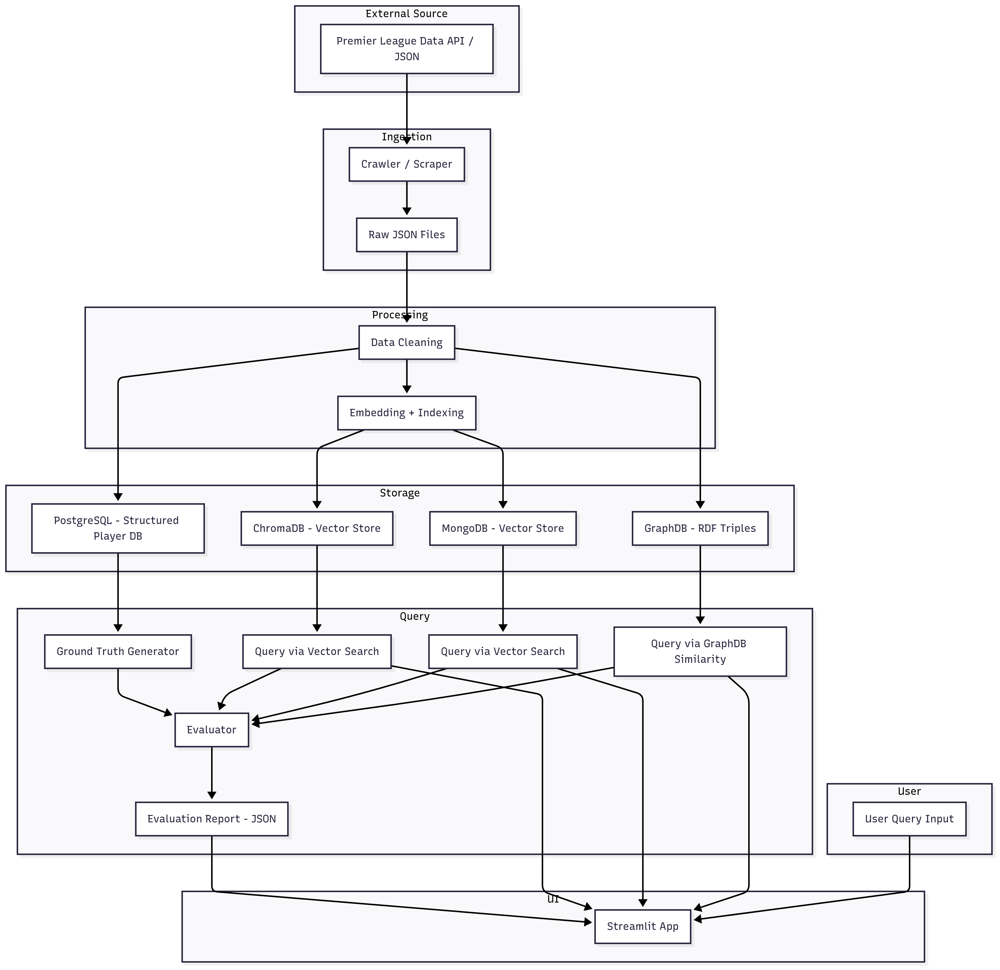

# Hệ thống tìm kiếm thông tin cầu thủ Premier League
Dự án xây dựng một hệ thống truy vấn ngữ nghĩa cho **thông tin cầu thủ bóng đá** thông qua các cơ sở dữ liệu khác nhau bao gồm **MongoDB, ChromaDB và GraphDB**. Hệ thống hỗ trợ:

- Tìm kiếm bằng ngôn ngữ tự nhiên (tiếng Anh)
- Truy vấn tương tự (similarity search)
- Đánh giá kết quả trả về dựa trên tập ground truth
- Giao diện trực quan với Streamlit


## Mô hình tổng quan


Luồng xử lý bao gồm các bước chính:
- Thu thập dữ liệu (Crawling) từ các nguồn Premier League chính thống trong giai đoạn 2020–2025.
- Tiền xử lý và sinh profile dạng văn bản cho mỗi cầu thủ.
- Chuyển đổi dữ liệu sang nhiều dạng lưu trữ khác nhau: vector cho ChromaDB và MongoDB, RDF triples cho GraphDB, bảng quan hệ cho PostgreSQL.
- Thực hiện truy vấn với vector search hoặc semantic search.
- So sánh kết quả trả về với ground truth được tạo thủ công hoặc từ cơ sở dữ liệu cấu trúc.
- Hiển thị kết quả trực quan qua giao diện Streamlit hỗ trợ so sánh ba hệ thống.

## Dữ liệu sử dụng
- Nguồn: Dữ liệu cầu thủ Premier League (2020-2025)
- Số lượng: 2175 cầu thủ
- Định dạng: JSON gốc -> Chuyển đổi sang dạng text mô tả (profile)
- Thông tim bao gồm: ngày sinh, quốc tịch, vị trí, thống ke theo mùa giải,...


## Đánh giá hiệu suất
Các chỉ số đánh giá

- Precision@k
- Recal@10
- F1@10

Kết quả từ 3 hệ thống (MongoDB, ChromaDB, GraphDB) được so sánh vói ground truth sinh ra từ PostrgreSQL dựa vào truy vấn SQL định nghĩa sẵn


## Giao diện Streamlit
```bash
streamlit run streamlit/app.py
```
Tính năng:
- So sánh truy vấn từ 3 hệ DB
- Hiển thị báo cáo đánh giá từ file `evaluation_report.json`
- Xem chi tiết hồ sơ cầu thủ


## Cài đặt
Cài đặt dependencies Python:
```bash
python3 -m venv venv
source venv/bin/activate
pip install -r requirements.txt
```


Hệ thống sử dụng ba loại cơ sở dữ liệu chính:

- **ChromaDB**: Vector database cho truy vấn ngữ nghĩa.
- **MongoDB Atlas / Local**: Lưu trữ vector và metadata người chơi.
- **GraphDB**: Triple store cho dữ liệu RDF và similarity search.

### 1. ChromaDB
```bash
make chroma-run
```
- Truy cập: http://localhost:3001 để kiểm tra Chroma Admin UI
- API: http://localhost:8000


### 2. GraphDB
```bash
make graphdb-run
```
- API: http://localhost:7200

### 3. MongoDB

Sử dụng Mongo Cloud Atlas
- https://cloud.mongodb.com

### 4.PostgreSQL

Hệ thống sử dụng PostgreSQL để lưu trữ dữ liệu có cấu trúc của cầu thủ nhằm mục đích tạo tập ground truth phục vụ cho đánh giá hiệu quả của hệ thống tìm kiếm.
- `postgres/sql/schema.sql`: định nghĩa các bảng như `players`, `clubs`, `stats`,...
- `postgres/insert.py`: script để chèn dữ liệu từ  `profile_data/` vào database
- `compose/postgres-compose.yml`: file cấu hình Docker Compose


```bash
make postgres-up
```
- API: http://localhost:5432
- DB name: premier_league
- Username/password: postgres / postgres

Insert dữ liệu
```
python postgres/insert.py
```


## Crawl data
Thu thập dữ liệu raw từ API Premier League

- Sử dụng các scripts trong folder `crawl` để tải JSON cầu thủ, câu lạc bộ, mùa giải,...
- Output là các file `.json` lưu tại folder `raw_data`

```bash
make crawl-all
```


##  Tạo profile data
Chuyển đổi dữ liệu thô thành mô sơ mô tả cầu thủ (profile) ở dạng text
Dữ liệu này sẽ được sử dụng cho:
- Sinh `vector_embedding` trong ChromaDB / MongoDB
- Tạo `dữ liệu mô tả RDF` cho GraphDB
- Kết quả trà ra được lưu tại folder `profile_data/player_profiles_detailed.json`

```bash
make generate-profiles
```

Dữ liệu mẫu
```json
{
    "playerId": "100649",
    "fullName": "Bernard Anício Caldeira Duarte",
    "profile_en": "PLAYER: Bernard Anício Caldeira Duarte (ID 100649)\nDate of Birth: 1992-09-08 | Nationality: Brazil (BR)\nPosition: Forward | Preferred Foot: Right\nHeight: 166 cm | Weight: 57 kg\nShirt Number: 20 | Joined Season: 2018\nCurrent Club: Everton (ID 11)\n\nSeason 2020/21 at Everton:\n- Appearances: 12.0 | Goals: 1.0 | Assists: 0\n- Minutes Played: 449.0 | Passes Completed: 222.0\n- Dribbles Completed: 10.0 | Tackles: 8.0 | Interceptions: 8.0\n- Duels Won: 25.0 | Aerial Duels Won: 0\n- Expected Goals (xG): 0 | Expected Assists (xA): 0\n- Yellow Cards: 2.0 | Red Cards: 0.0\n- Offsides: 0 | Touches in Box: 366.0\n- Crosses Completed: 3.0 | Hit Woodwork: 0\n\nSeason 2021/22 at Everton:\n- Appearances: 0 | Goals: 0 | Assists: 0\n- Minutes Played: 0 | Passes Completed: 0\n- Dribbles Completed: 0 | Tackles: 0 | Interceptions: 0\n- Duels Won: 0 | Aerial Duels Won: 0\n- Expected Goals (xG): 0 | Expected Assists (xA): 0\n- Yellow Cards: 0 | Red Cards: 0\n- Offsides: 0 | Touches in Box: 0\n- Crosses Completed: 0 | Hit Woodwork: 0"
}
```


## RDF Conversion Scripts
Chuyển đổi dữ liệu sang định dạng RDF (.ttl) để import vào **GraphDB**

- Sử dụng profile data `player_profiles_detailed.json` và script nằm trong folder `rdf_scripts`
- Kết quả được lưu tại folder `rdf_output/player_profiles.ttl`

```bash
make rdf-profiles
```
Dữ liệu mẫu
```text
@prefix ex: <http://example.org/premierleague/> .
@prefix xsd: <http://www.w3.org/2001/XMLSchema#> .

ex:player_100649 a ex:Player ;
    ex:hasName "Bernard Anício Caldeira Duarte" ;
    ex:profileText """PLAYER: Bernard Anício Caldeira Duarte (ID 100649)
Date of Birth: 1992-09-08 | Nationality: Brazil (BR)
Position: Forward | Preferred Foot: Right
Height: 166 cm | Weight: 57 kg
Shirt Number: 20 | Joined Season: 2018
Current Club: Everton (ID 11)

Season 2020/21 at Everton:
- Appearances: 12.0 | Goals: 1.0 | Assists: 0
- Minutes Played: 449.0 | Passes Completed: 222.0
- Dribbles Completed: 10.0 | Tackles: 8.0 | Interceptions: 8.0
- Duels Won: 25.0 | Aerial Duels Won: 0
- Expected Goals (xG): 0 | Expected Assists (xA): 0
- Yellow Cards: 2.0 | Red Cards: 0.0
- Offsides: 0 | Touches in Box: 366.0
- Crosses Completed: 3.0 | Hit Woodwork: 0

Season 2021/22 at Everton:
- Appearances: 0 | Goals: 0 | Assists: 0
- Minutes Played: 0 | Passes Completed: 0
- Dribbles Completed: 0 | Tackles: 0 | Interceptions: 0
- Duels Won: 0 | Aerial Duels Won: 0
- Expected Goals (xG): 0 | Expected Assists (xA): 0
- Yellow Cards: 0 | Red Cards: 0
- Offsides: 0 | Touches in Box: 0
- Crosses Completed: 0 | Hit Woodwork: 0"""^^xsd:string .
```

## Import RDF vào GraphDB
- Truy cập GraphDB ở địa chỉ: http://localhost:7200
- Tạo repository `premier-league`
- Upload file `.ttl` bằng giao diện web


## Embedding và lưu trữ trong Chroma và Mongo
Sử dụng mô hình SentenceTransformer("all-MiniLM-L6-v2") để embedding

### ChromaDB

- Thưc thi đoạn script trong folder `chromadb/main.py` để tạo collection, embedding và lưu trữ
```
python chromadb/main.py
```

### MongoDB

- Thưc thi đoạn script trong folder `mongodb/main.py` để tạo collection, embedding và lưu trữ
```
python mongodb/main.py
```


## Xây dựng Ground Truth

Đóng vai trò như tập dữ liệu tham chiếu tin cậy để đánh giá hiệu quả của các phương pháp tìm kiếm. 
Nó chứa các câu truy vấn và kết quả tương ứng được tạo thủ công và bán tự động dựa vào PostgreSQL

Dữ liệu đầu vào để tạo ground truth
```json
[
  {
    "query": "Find the top scorer in the 2022 season",
    "sql": "SELECT full_name FROM player_stats WHERE season = 2022 ORDER BY goals DESC LIMIT 1;",
  },
  ...
]
```

Cách tạo grouth truth:

- Thưc thi đoạn script trong folder `ground_truth/generate_ground_truth.py`
- Đọc các câu truy vấn từ `queries_with_sql.json` 
- Thực thi các câu SQL tương ứng 
- Lưu kết quả ground_truth


Cấu trúc dữ liệu ground truth
```json
[
  {
    "query": "Find the top scorer in the 2022 season",
    "sql": "SELECT full_name FROM player_stats WHERE season = 2022 ORDER BY goals DESC LIMIT 1;",
    "ground_truth": ["Erling Haaland"]
  },
  ...
]
```
- query: Câu truy vấn ngôn ngữ tự nhiên
- sql: Câu SQL được ánh xạ
- grount_truth: Danh sách tên câu thủ đúng tương ứng


Kết hợp kết quả từ các DB

- Sử dụng script trong folder `groound_truth/generate_vector_results`để tự động đánh giá kết quả của các DB
- Kết quả được lưu vào `ground_truth/vector_results.json`
```json
[
  {
    "query": "...",
    "mongo_results": ["Player A", "Player B", ...],
    "chroma_results": [...],
    "graphdb_results": [...]
  }
]
```


Đánh giá Precision, Recall, F1

- Sử dụng script `ground_truth/evluate.py` để đánh giá kết quả đạt được từ file `ground_truth/vector_results.json`
- Kết quả được lưu vào file `ground_truth/evaluation_report.json`
```json
{
  "mongo_results": {
    "precision@5": 0.2733,
    "recall@5": 0.028,
    "f1@5": 0.0365
  },
  "chroma_results": {
    "precision@5": 0.2733,
    "recall@5": 0.028,
    "f1@5": 0.0365
  },
  "graphdb_results": {
    "precision@5": 0.24,
    "recall@5": 0.0142,
    "f1@5": 0.0248
  }
}
```


## Streamlit UI
Xây dựng giao diện để người dùng tương tác với hệ thống truy vấn

- Nhập câu truy vấn ngôn ngữ tự nhiên
- Lựa chọn cơ sở dữ liệu cần truy vấn (MongoDB, ChromaDB hoặc GraphDB)
- Xem kết quả truy vấn hiển thị dứoi dạng bảng
- So sánh kết quả giữa các DB
- Hiển thị kết quả đánh giá truy vấn với ground truth


```
streamlit run streamlit/app.py
```