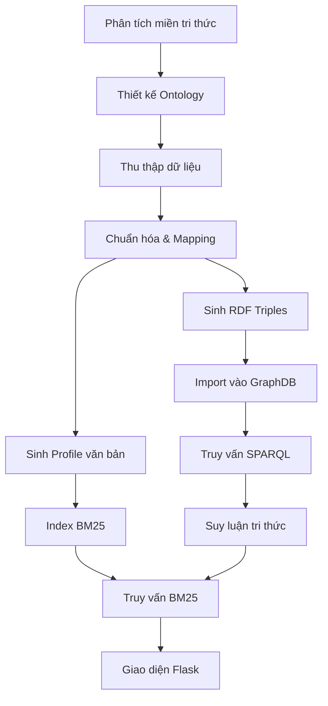

# 📄 ĐỒ ÁN CUỐI KỲ - XÂY DỰNG HỆ THỐNG TRI THỨC BÓNG ĐÁ

**Thời gian**: Thứ Bảy, 02/08/2025 - 8:30 AM\
**Hình thức**: Mỗi nhóm 10-15 phút, theo danh sách đã đăng ký, chuẩn bị slide hoặc demo file

---

## 1. 🔍 Giới thiệu chung

- **Mục tiêu tổng thể**: Xây dựng hệ thống tri thức dạng RDF về cầu thủ bóng đá giúp tổ chức, truy vấn và suy luận thông tin hiệu quả, từ đó hỗ trợ phân tích, tìm kiếm và khai thác thông minh dữ liệu thể thao.
- **Bài toán nghiên cứu**: Biểu diễn dữ liệu phi cấu trúc (API Premier League) thành tri thức có thể truy vấn, suy luận. Kết hợp phương pháp tìm kiếm truyền thống (BM25) với nền tảng ontology OWL để hướng tới khả năng tìm kiếm ngữ nghĩa.
- **Phạm vi đề tài**: Chỉ áp dụng cho Premier League từ mùa giải 2020 đến 2024, tập trung vào các lớp cơ bản: Player, Club, Season, Position, Nationality và thống kê theo mùa.
- **Giới hạn**: Không bao phủ dữ liệu giải khác, không xử lý dữ liệu thời gian thực, chưa tích hợp trực tiếp vào hệ thống phân tích nâng cao.

### 🧭 Tổng quan pipeline hệ thống:

###

1. **Phân tích miền tri thức**: xác định các thực thể và quan hệ chính
2. **Thiết kế ontology**: dùng Protégé xuất OWL/Turtle
3. **Thu thập dữ liệu**: crawl Premier League API theo season
4. **Chuẩn hóa và mapping**: dữ liệu được chuẩn hóa theo ontology
5. **Sinh RDF triples**: bằng Python, lưu thành TTL
6. **Import vào GraphDB**: dùng Docker + SPARQL test
7. **Sinh profile văn bản**: mô tả tự nhiên dùng cho BM25
8. **Reasoning & BM25**: tạo luật suy luận và tìm kiếm bằng Whoosh
9. **Xây dựng giao diện Flask**: tìm kiếm cầu thủ qua ngôn ngữ tự nhiên

- **Mục tiêu chính**: Xây dựng hệ thống tri thức về cầu thủ bóng đá theo chuẩn RDF và ontology
- **Bài toán nghiên cứu**:
  - Biểu diễn dữ liệu dạng triples
  - Cho phép truy vấn theo thuộc tính + reasoning rule
  - Kết hợp BM25 thay SPARQL trong truy vấn tự nhiên
- **Phạm vi**: Premier League mùa 2020 → 2024
- **Giới hạn**: Chưa khai thác reasoning + BM25 đầy đủ trong giai đoạn 1

---

## 2. 📄 Nội dung thực hiện

- Phân tích lớp: Player, Club, Season, Stats, Position, Nationality
- Thiết kế ontology trong Protégé, export OWL + TTL
- Crawl API Premier League theo season
- Mapping và tiền xử lý (country, height, joinedSeason...)
- Sinh RDF triples (player, stats, season...)
- Viết Makefile hoá pipeline
- Import RDF và truy vấn SPARQL test OK

---

## 3. 🗓️ Timeline thực hiện

| Tuần   | Mốc công việc                           |
| ------ | --------------------------------------- |
| Tuần 1 | Xây ontology, phân tích mô hình         |
| Tuần 2 | Viết crawler player theo season         |
| Tuần 3 | Crawl detail + stats, chuẩn hóa dữ liệu |
| Tuần 4 | Sinh RDF, import GraphDB, test SPARQL   |
| Tuần 5 | Chuẩn bị reasoning + BM25 profile       |

---

## 4. 🚀 Công việc đã hoàn thành

- Crawl toàn bộ danh sách cầu thủ (5000+) theo mùa
- Lấy chi tiết Player (thông tin, profile, club, stats...)
- Crawl thông tin Club + Season
- Sinh RDF: players.ttl, clubs.ttl, player\_stats.ttl, schema.ttl...
- Import và test SPARQL: top scorer, teammates, by nationality...
- Makefile hoá toàn pipeline: crawl → rdf → graphdb

---

## 5. 🚪 Khó khăn, vướng mắc

- Khó khi định nghĩa ontology: object/datatype properties
- API Premier League thị thoảng lỗi 502, không đủ field
- Các clubId, seasonId không có mapping rõ ràng
- Dữ liệu RDF: nhạy cảm syntax + type (xsd\:int, xsd\:date)
- Reasoning + BM25 chưa rõ workflow để tích hợp

---

## 6. 📋 Kế hoạch tiếp theo

- Sinh profile text ("Messi is a forward from Argentina...")
- Viết tool index Whoosh (BM25)
- Tích hợp reasoning rule (IF goals > 50 THEN isStar)
- Giao diện Flask search UI (Google-style)
- Trực quan WebVOWL, SPARQL Explorer

---

## 7. ✅ Kết luận

- Hoàn thành RDF pipeline đẳng cấp
- Dữ liệu tổ chức bằng ontology chuẩn OWL
- Sẵn sàng chuyển sang reasoning + BM25 + truy vấn UI

